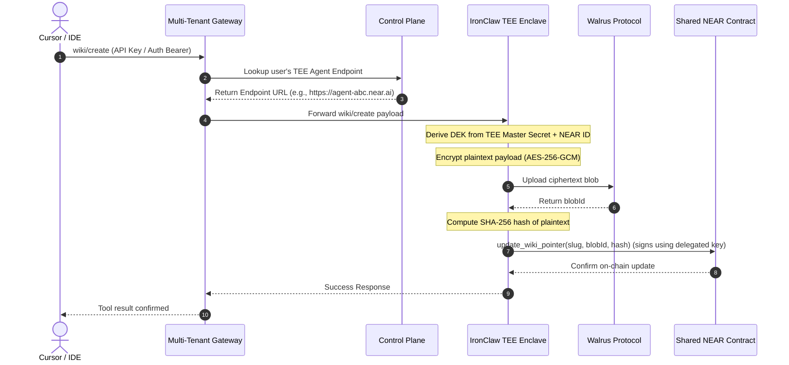

# Aegis Simplified Multi-Tenant SaaS Architecture

Sir, this document outlines the simplified multi-tenant SaaS architecture for Project Aegis. This design leverages hosted Trusted Execution Environments (TEEs) on the NEAR AI Cloud (IronClaw), a shared smart contract, and a multi-tenant gateway to eliminate individual hardware and deployment friction for end users.

---

## 1. High-Level Architecture Overview

Instead of requiring every user to deploy their own smart contracts, run local enclaves, and manage Walrus tokens, the product operates as a managed security-conscious SaaS. The core security promise remains intact: **plaintext data and keys never leave the TEE enclaves.**

```
                     ┌────────────────────────┐
                     │   Frontend Dashboard   │ (React + Vite + CSS)
                     │ Onboarding / API Keys  │
                     └───────────┬────────────┘
                                 │ HTTP / API Keys
                                 ▼
                     ┌────────────────────────┐
                     │ Multi-Tenant Gateway   │ (Hono on Cloudflare Workers)
                     │ (Auth / Routing / MCP) │
                     └───────────┬────────────┘
                                 │
                 ┌───────────────┴───────────────┐
                 ▼                               ▼
     ┌───────────────────────┐       ┌───────────────────────┐
     │  User A TEE Agent     │       │  User B TEE Agent     │
     │  IronClaw (Intel TDX) │       │  IronClaw (Intel TDX) │
     │  (NEAR AI Cloud)      │       │  (NEAR AI Cloud)      │
     └───────────┬───────────┘       └───────────┬───────────┘
                 │                               │
                 └───────────────┬───────────────┘
                                 │
                                 ├──────────────────────────────┐
                                 ▼                              ▼
                     ┌───────────────────────┐      ┌───────────────────────┐
                     │ Shared NEAR Contract  │      │ Walrus Storage Pool   │
                     │  (Pointer Registry)   │      │  (Opaque Ciphertext)  │
                     └───────────────────────┘      └───────────────────────┘
```

---

## 2. Key Components & Responsibilities

### A. Frontend Dashboard (React + Vite + CSS)
*   **Onboarding**: Guides the user through connecting their NEAR wallet (e.g., via NEAR Wallet Selector).
*   **Access Delegation**: Initiates a transaction to register the gateway's public key as a **Function Call Access Key (FCAK)** on the user's NEAR account.
*   **Orchestration**: Directs TEE deployment via one-click links or APIs.
*   **Vault Explorer**: Displays wiki indexes and skill registries retrieved from the shared smart contract.

### B. Control Plane (Lightweight SaaS Backend)
*   **User Registry**: Maps user identities (NEAR accounts or emails) to their corresponding TEE endpoints.
*   **API Key Management**: Issues and revokes gateway API keys scoped to user accounts.
*   **Billing & Subscription**: Connects to payment processors (e.g., Stripe) to handle plans and credit usage (including markup on decentralized storage/gas).
*   **TEE Orchestration**: Interfaces with the NEAR AI Cloud API to spin up and monitor enclaves.

### C. Multi-Tenant MCP Gateway (Cloudflare Workers)
*   **Authentication**: Validates incoming client requests (e.g., Cursor, Claude Desktop) using the issued API keys.
*   **Routing**: Resolves the user's account ID and forwards the JSON-RPC request to their dedicated IronClaw TEE endpoint.
*   **Statelessness**: Avoids local storage or caching of session secrets.

### D. TEE Agent (IronClaw on NEAR AI Cloud)
*   **Plaintext Execution**: Receives tool parameters, executes logic, and reads/writes vault files.
*   **Zero-Knowledge Encryption**: Derives the Data Encryption Key (DEK) inside the enclave from the hardware-sealed master secret and the user's NEAR Account ID.
*   **Decentralized Storage Interaction**: Encrypts plaintext using AES-256-GCM, uploads to Walrus, and updates the shared smart contract.
*   **Egress Firewall**: The ZDR firewall audits outbound API requests inside the enclave boundary before transmission.

### E. Shared NEAR Smart Contract (Rust)
*   **Index Storage**: Registers the `blobId` and SHA-256 integrity hash for each wiki page or skill under the namespace `{account_id}:{slug}`.
*   **Gas & Storage Economics**: Stakeless view calls. Write operations utilize the delegated Function Call Access Key, funded by user/operator pools.

---

## 3. Data Flow: Wiki Page Creation



---

## 4. Security & Trust Model

Aegis implements a **hardware-enforced zero-knowledge** boundary. The provider orchestrates the plumbing, but possesses no technical means to inspect the user's decrypted vaults.

| Component | Sees Plaintext? | Sees Decryption Keys? | Trust Mechanism |
| :--- | :--- | :--- | :--- |
| **Frontend Dashboard** | Only inside the browser | No | Runs locally on user's machine. |
| **Multi-Tenant Gateway** | No | No | Only intercepts encrypted blobs and coordinates routing. |
| **Control Plane** | No | No | Orchestration layer only. |
| **IronClaw TEE Enclave** | **Yes** (Inside hardware) | **Yes** (Sealed in enclave memory) | Hardware-backed Intel TDX / AMD SEV-SNP attestation. |
| **Walrus Storage** | No (Opaque ciphertext) | No | Erasure-coded decentralized network. |
| **Shared NEAR Contract** | No (Only metadata/hashes) | No | Opaque on-chain index. |

---

## 5. Implementation Roadmap (NEAR SDK & Web3 Patterns)

### A. NEAR signature authentication (NEP-413)
To authenticate user log-ins to the dashboard passwordlessly, the frontend uses standard **NEP-413** message signing. The signature is verified on the backend (Control Plane / Gateway) using `@noble/ed25519`:

```typescript
import { verify } from "@noble/ed25519";
import { sha256 } from "@noble/hashes/sha256";

// Message structure according to NEP-413 standard
const message = JSON.stringify({
  message: "Authenticate with Aegis Dashboard",
  recipient: "aegis-mcp-bridge.near",
  nonce: challengeNonce, // 32-byte unique challenge generated by gateway
});

const messageHash = sha256(new TextEncoder().encode(message));
const isValid = await verify(signatureBytes, messageHash, publicKeyBytes);
```

### B. Transaction Signing Delegation (Function Call Access Keys)
The gateway submits update transactions on behalf of the user. During onboarding, the frontend invokes a wallet request to add the gateway's public key as an access key:

```typescript
import { connect, WalletConnection } from "near-api-js";

const wallet = new WalletConnection(nearInstance, "aegis-app");
wallet.requestSignIn({
  contractId: "aegis-vault.near",
  methodNames: ["update_wiki_pointer", "remove_wiki_pointer", "update_skill_pointer", "remove_skill_pointer"],
  publicKey: GATEWAY_FUNCKEY_PUBKEY, // The gateway's public key generated at deployment
});
```

This registers the gateway's public key on the user's account, allowing the gateway to sign transaction payloads using `GATEWAY_FUNCKEY_PRIVKEY` without the user's master private key ever leaving the enclave.
